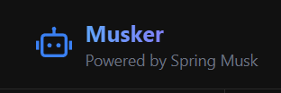

# Musker - Open Source AI Chatbot



Musker is a free, open-source AI chatbot platform that leverages Cloudflare Workers AI for chat and image generation capabilities, with authentication and data persistence powered by Supabase.

**Musker can be hosted 100% free of cost just with a cloudflare account**

> **⚠ Info:** Currently Backend code isnt public we'll do some refactors on code and must be with you soon


## Features

- 🤖 Real-time AI chat conversations
- 🎨 AI image generation
- 🔐 User authentication via Supabase
- 💾 Persistent chat history
- 🎯 Multiple chat sessions support
- 📱 Responsive design
- ⚡ Fast performance with Cloudflare Workers

## Tech Stack

- **Frontend**: React + TypeScript + Vite
- **Styling**: TailwindCSS
- **Authentication**: Supabase Auth
- **Database**: Supabase PostgreSQL
- **AI Provider**: Cloudflare Workers AI
- **Deployment**: Cloudflare Pages

## Live Demo
- **Website**: [Musker.pages.dev](https://musker.pages.dev/) 

## Getting Started

### Prerequisites

- Node.js 18+
- npm or yarn
- Supabase account
- Cloudflare account

### Installation

1. Clone the repository:
```bash
git clone https://github.com/springmusk026/Musker.git
cd musker
```

2. Install dependencies:
```bash
npm install
```

3. Configure Variables:
-Rename .env.example to .env
    ```env
    VITE_WORKER_URL=your_cloudflare_worker_url
    VITE_SUPABASE_URL=your_supabase_project_url
    VITE_SUPABASE_ANON_KEY=your_supabase_anon_key
    ```

4. Run the development server:
```bash
npm run dev
```

## Project Structure

```
musker/
├── src/
│   ├── api/          # API integration
│   ├── components/   # React components
│   ├── hooks/        # Custom React hooks
│   ├── styles/       # Global styles
│   └── types/        # TypeScript types
├── public/           # Static assets
```

## Contributing

This project was initially created for learning purposes, but contributions are welcome! Please note that there might be bugs, security risks, or areas for improvement.

1. Fork the repository
2. Create your feature branch (`git checkout -b feature/amazing-feature`)
3. Commit your changes (`git commit -m 'Add some amazing feature'`)
4. Push to the branch (

git push origin feature/amazing-feature

)
5. Open a Pull Request

## Disclaimer

⚠️ This project was created for learning purposes and may contain:
- Bugs or issues
- Security vulnerabilities
- Non-optimized code
- Areas for improvement

Use at your own risk in production environments.

## License

This project is licensed under the MIT License - see the LICENSE file for details.

## Acknowledgments

- [Cloudflare Workers AI](https://developers.cloudflare.com/workers-ai/) for AI capabilities
- [Supabase](https://supabase.com/) for authentication and database
- [React](https://reactjs.org/) and the React community
- [TailwindCSS](https://tailwindcss.com/) for styling

## Contact

Spring Musk - [@springmusk026](https://github.com/springmusk026)

Project Link: [https://github.com/springmusk026/Musker](https://github.com/springmusk026/Musker)
